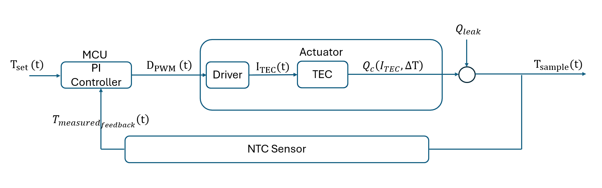

# TEC Control Driver
This repository contains the current design progress for the TEC control system and hardware implementation. The control-flow chart and hardware schematic are included in this project. 

### Control Flow Chart




### Hardware Schematic


The full engineering log that contains discussion of circuit design and analysis is also provided as `engineering_log.pdf` in the repository.
## Folder Structure

Contain two folders:

- hardware: contains the KiCad schematic files for the TEC driver circuit design.
- analysis: contains the control-system analysis and simulation files, including the Jupyter    Notebook used for s-domain derivation, PI controller analysis, and time-domain simulation.

## Python Environment Setup

For creating a Python virtual environment and installing the required libraries so the Jupyter Notebook simulation can be run.

Open PowerShell in the project folder and run:

```powershell
python -m venv .venv
.\.venv\Scripts\Activate.ps1
python -m pip install -r requirements.txt
```
Then open the notebook to try yourself in live
