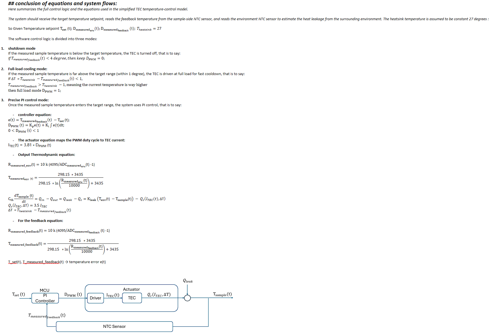

# Control Analysis and Test

All above equations and control flow are analyzed using the Python Jupyter Notebook file included in this folder.

In conclusion, with the help of Python tools, I combined the control equations and derived the transfer function for the TEC control system.

From the s-domain analysis, the closed-loop poles are on the left side of the s-plane, so the control system is stable and can converge to the target temperature.

To get a good tradeoff between response speed and stability, I selected a critically damped response by setting two repeated real poles:

$$
s_1 = s_2 = -\omega_n
$$

This gives a relationship for \(K_p\) and \(K_i\), so they are no longer arbitrary tuning numbers. Instead, they are linked with the system parameters.

So the main parameters are narrowed down to:

$$
C_{th},\ K_{leak},\ \omega_n
$$

Finally, I used time-domain simulation to test the control logic. The simulation shows that the system can converge to the target temperature, and the response curve looks reasonable.