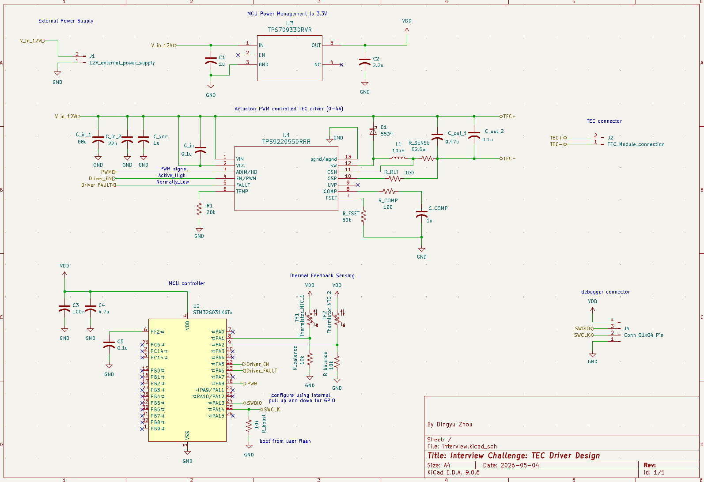

# Hardware Schematic Description

This folder contains the hardware schematic for the TEC driver design.

The schematic is divided into several functional modules.

## External Power and Connectors

The external power connector provides the 12V input supply for the system. The TEC connector is used to connect the driver output to the TEC device. A debugging connector is included for MCU flashing and debugging.

## MCU Power Management

The MCU power-management module uses the [`TPS7B6933QDBVR`](https://www.digikey.com/en/products/detail/texas-instruments/TPS7B6933QDBVRQ1/5358037) LDO regulator to convert the 12V input supply into a regulated 3.3V supply for the MCU and its supporting circuitry.

## MCU Controller

The [`STM32G031C6T6`](https://www.digikey.com/en/products/detail/stmicroelectronics/STM32G031C6T6/10300268) MCU is used as the main processor of the system. It reads the thermal feedback signals, processes the control algorithm, and generates the PWM control signal for the TEC driver.

## PWM-Controlled TEC Driver

The TEC driver stage uses the [`TPS922055DRRR`](https://www.digikey.com/en/products/detail/texas-instruments/TPS922055DRRR/22106744) driver IC as the actuator of the system. It receives the PWM control signal from the MCU and controls the TEC output current. The designed output current range is approximately 0A to 3.81A.

## Thermal Feedback Sensing

The thermal feedback sensing module uses [`103AT-4-70374`](https://www.digikey.com/en/products/detail/semitec-usa-corp/103AT-4-70374/16578953) pearl-shaped leaded NTC thermistors connected to the MCU ADC inputs. The MCU reads these feedback signals to estimate the sample temperature and environmental temperature, then adjusts the PWM command for closed-loop temperature control.